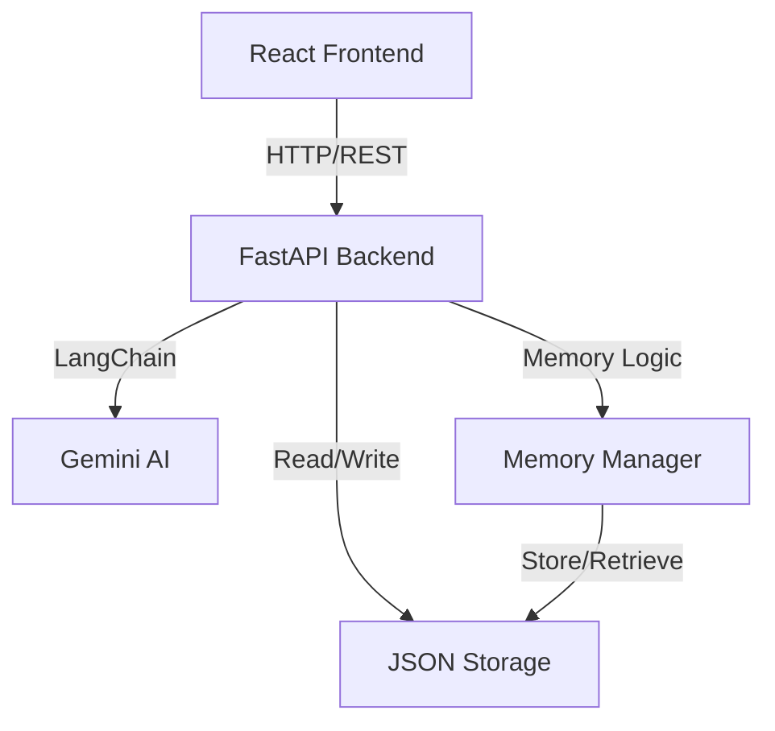

# Memora - AI Agent with Long-Term Memory

A voice/text-interactive AI assistant with persistent long-term memory capabilities. Built with LangChain, Google Gemini, JSON Storage, and React.

## 🌟 Features

- **💬 Natural Conversations**: Chat with an AI that understands context and maintains conversation flow
- **🧠 Long-Term Memory**: Automatically stores and recalls preferences, goals, and important information
- **🎤 Voice Input**: Speak to the assistant using Web Speech API (browser-based)
- **📊 Memory Visualization**: See your memory statistics and connection status in real-time
- **🔄 Cross-Session Persistence**: Memories persist across browser sessions and devices
- **🎨 Modern UI**: Beautiful glassmorphism design with smooth animations
- **⚡ Real-Time Updates**: Instant responses with loading indicators

## 🏗️ Architecture



## 🛠️ Tech Stack

### Backend
- **FastAPI**: High-performance async API framework
- **LangChain**: LLM orchestration and conversation management
- **Google Gemini**: Advanced AI language model
- **JSON Storage**: Lightweight file-based memory storage
- **Pydantic**: Data validation and settings management

### Frontend
- **React 18**: Modern UI library with hooks
- **Vite**: Fast build tool and dev server
- **TailwindCSS**: Utility-first CSS framework
- **Axios**: HTTP client for API communication
- **Lucide React**: Beautiful icon library
- **Web Speech API**: Browser-based voice input

## 📦 Installation

### Prerequisites
- Python 3.11+
- Node.js 18+
- Google Gemini API key ([Get one here](https://makersuite.google.com/app/apikey))

### Backend Setup

```bash
cd backend

# Create virtual environment
python -m venv venv
source venv/bin/activate  # On Windows: venv\Scripts\activate

# Install dependencies
pip install -r requirements.txt

# Configure environment
cp .env.example .env
# Edit .env and add your GEMINI_API_KEY

# Run the server
python main.py
```

The backend will start at `http://localhost:8000`

### Frontend Setup

```bash
cd frontend

# Install dependencies
npm install

# Configure environment
cp .env.example .env
# Edit .env if needed (default points to localhost:8000)

# Run the dev server
npm run dev
```

The frontend will start at `http://localhost:5173`

## 🚀 Usage

1. **Start a Conversation**: Type a message or click the microphone icon to speak
2. **Enable Memory**: Toggle the "Enable Memory" checkbox to control memory storage
3. **View Memory Stats**: Check the sidebar to see total memories and connection status
4. **Clear Chat**: Click the "Clear" button to reset the conversation history

### Example Interactions

```
You: My name is Alex and I love pizza
Assistant: Nice to meet you, Alex! I'll remember that you love pizza.

[Later session]
You: What's my favorite food?
Assistant: Based on what you told me before, you love pizza!
```

## 📡 API Documentation

### Endpoints

#### POST `/chat`
Send a message and get a response with memory context.

**Request:**
```json
{
  "message": "Hello!",
  "user_id": "default_user",
  "memory_enabled": true
}
```

**Response:**
```json
{
  "response": "Hi! How can I help you?",
  "memories_used": [],
  "timestamp": "2025-12-01T12:00:00Z"
}
```

#### POST `/remember`
Explicitly store information in memory.

**Request:**
```json
{
  "key": "favorite_color",
  "value": "blue",
  "user_id": "default_user"
}
```

#### POST `/recall`
Search for memories based on a query.

**Request:**
```json
{
  "query": "favorite color",
  "user_id": "default_user",
  "limit": 5
}
```

#### GET `/status`
Get memory statistics and system status.

**Query Params:** `user_id=default_user`

## 🐳 Docker Deployment

### Build and Run with Docker

```bash
# Build backend image
cd backend
docker build -t memora-backend .

# Run container
docker run -p 8000:8000 \
  -e GEMINI_API_KEY=your_key_here \
  memora-backend
```

### Deploy to Render

1. Push your code to GitHub
2. Connect your repository to Render
3. Render will automatically detect `render.yaml`
4. Add `GEMINI_API_KEY` in Render dashboard
5. Deploy!

For frontend, deploy to Netlify or Vercel:
- Build command: `npm run build`
- Publish directory: `dist`
- Environment variable: `VITE_API_URL=https://your-backend.onrender.com`

## 🧪 Memory Detection Logic

The system automatically detects and stores memories when you:

- Express preferences: "I like...", "I love...", "My favorite..."
- Ask to remember: "Remember...", "Don't forget...", "Keep in mind..."
- Share goals: "I want to...", "I'm trying to...", "My goal is..."
- Provide personal info: "My name is...", "I work as...", "I live in..."

## 🔒 Environment Variables

### Backend (.env)
```env
GEMINI_API_KEY=your_gemini_api_key

CORS_ORIGINS=http://localhost:5173,http://localhost:3000
HOST=0.0.0.0
PORT=8000
```

### Frontend (.env)
```env
VITE_API_URL=http://localhost:8000
```

## 📁 Project Structure

```
memora/
├── backend/
│   ├── main.py                 # FastAPI application
│   ├── config.py               # Configuration management
│   ├── models.py               # Pydantic models
│   ├── memory_manager.py       # ChromaDB memory operations
│   ├── conversation_handler.py # LangChain conversation logic
│   ├── requirements.txt        # Python dependencies
│   ├── Dockerfile             # Docker configuration
│   └── .env.example           # Environment template
├── frontend/
│   ├── src/
│   │   ├── components/        # React components
│   │   ├── hooks/            # Custom React hooks
│   │   ├── services/         # API service layer
│   │   ├── App.jsx           # Main app component
│   │   └── index.css         # Global styles
│   ├── package.json
│   ├── tailwind.config.js
│   └── vite.config.js
└── render.yaml               # Render deployment config
```

## 🤝 Contributing

Contributions are welcome! Please feel free to submit a Pull Request.

## 📄 License

MIT License - feel free to use this project for learning or commercial purposes.

## 🙏 Acknowledgments

- Google Gemini for the powerful AI model
- LangChain for LLM orchestration
- The open-source community

---

Built with ❤️ using modern AI and web technologies
